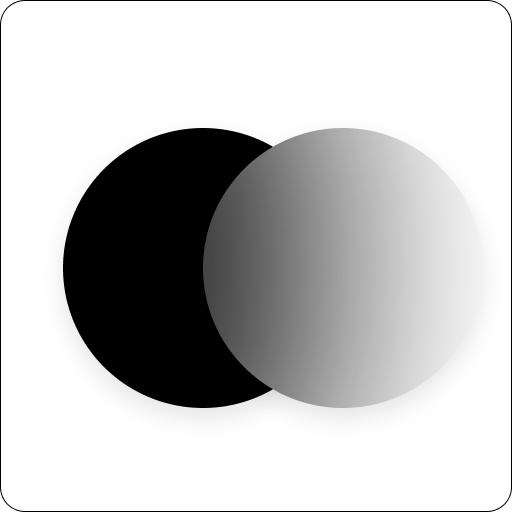

<div align="center">
  
  <h1>Dev Build</h1>
  <p><strong>A Reusable Expo Development Client for React Native Projects</strong></p>
</div>

---

## 📋 Overview

**Dev Build** is a pre-configured [Expo](https://expo.dev) development client that streamlines mobile app development with React Native. Instead of rebuilding your dev client every time you add a native library, this project provides a stable, feature-rich foundation that works across multiple projects.

### ✨ Key Benefits

- **One-time Setup**: Build once, use across multiple projects
- **Pre-configured Libraries**: Includes 50+ essential packages for modern React Native development
- **Native Code Support**: Ready for libraries that require native modules
- **Easy Updates**: Simply run `expo prebuild` after adding new dependencies
- **Time Saver**: Eliminate repetitive builds with `expo prebuild` and `expo run:android/ios`

---

## 📦 What's Included

This project comes pre-configured with a comprehensive set of libraries for building modern mobile applications:

### Core Framework

- **Expo** (`54.0.33`) - React Native framework with managed workflow
- **React** (`19.1.0`) & **React Native** (`0.81.5`)
- **TypeScript** (`5.9.3`) - Type-safe development
- **Expo Router** (`6.0.23`) - File-based routing

### Navigation & UI

- `@react-navigation/*` - Powerful navigation library
- `@shopify/flash-list` - High-performance list component
- `nativewind` - Tailwind CSS for React Native
- `react-native-reanimated` - Smooth animations

### Storage & Backend

- `@react-native-firebase/*` - Firebase integration (Auth, Firestore, Storage, Messaging)
- `@supabase/supabase-js` - Supabase backend client
- `@react-native-async-storage/async-storage` - Local data persistence
- `expo-sqlite` - Local SQLite database

### Device & Media

- `expo-camera` - Camera access
- `expo-image-picker` - Image selection
- `expo-file-system` - File system access
- `expo-av` - Audio & video playback
- `expo-notifications` - Push notifications

### Utilities & Tools

- `axios` - HTTP client
- `dayjs` - Date manipulation
- `expo-haptics` - Haptic feedback
- `react-native-svg` - SVG rendering
- `@expo/vector-icons` - Icon library

### Development Tools

- `expo-dev-client` - Custom development client
- `eslint` - Code linting
- `expo-updates` - Over-the-air updates support

### All

For a complete list of included libraries and their versions, see the [package.json](./package.json) file.

---

## 🚀 Getting Started

### Option 1: Download Pre-built Binary

Download the compiled dev build from the [Releases](../../releases) page and install it on your device.

### Option 2: Build Locally

#### Prerequisites

- Node.js 16+ and npm/yarn installed
- Xcode (for iOS) or Android Studio (for Android) or your device
- Git

#### Installation Steps

1. **Clone the repository**

    ```bash
    git clone https://github.com/rehd2/Dev-Build.git
    cd Dev-Build
    ```

2. **Install dependencies**

    ```bash
    npm install
    # or
    yarn install
    ```

3. **Generate native code**

    ```bash
    npx expo prebuild
    ```

4. **Build for your platform**
    - **Android**:
        ```bash
        npx expo run:android
        ```
    - **iOS**:
        ```bash
        npx expo run:ios
        ```
    - **Cloud Build**:
        ```bash
        npx eas build --profile development --platform ( all | android | ios )
        ```

5. **Start the development server**
    ```bash
    npx expo start
    ```

---

## 📝 Usage

Once built, you can use this dev client with any Expo project:

1. Set your Expo project to use this dev client
2. Run `npx expo start` in your project
3. Scan the QR code with the dev client app

The dev client will reload your app as you make changes to your code.

---

## 🔧 Adding New Dependencies

To add a new native library to this dev client:

1. Install the package

    ```bash
    npm install <package-name>
    ```

2. Regenerate native code

    ```bash
    npx expo prebuild --clean
    ```

3. Rebuild the dev client
    ```bash
    npx expo run:android  # or run:ios
    ```

---

## 📚 Resources

- [Expo Documentation](https://docs.expo.dev/)
- [React Native Documentation](https://reactnative.dev/)
- [Expo Dev Client Guide](https://docs.expo.dev/develop/development-builds/introduction/)

---

## 📄 License

This project is open source. See the LICENSE file for details.

---

## 🤝 Contributing

Contributions are welcome! Feel free to submit issues and pull requests to improve this project.

---

<div align="center">
  <strong>Made with ❤️ for the React Native community</strong>
</div>
